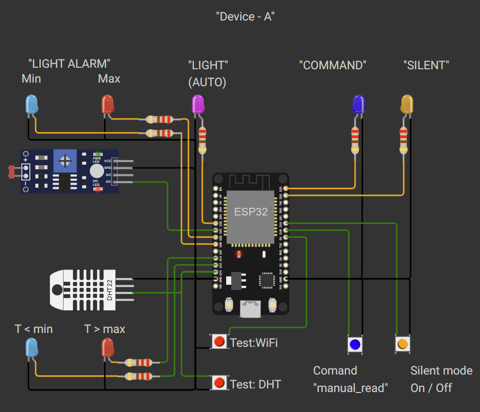
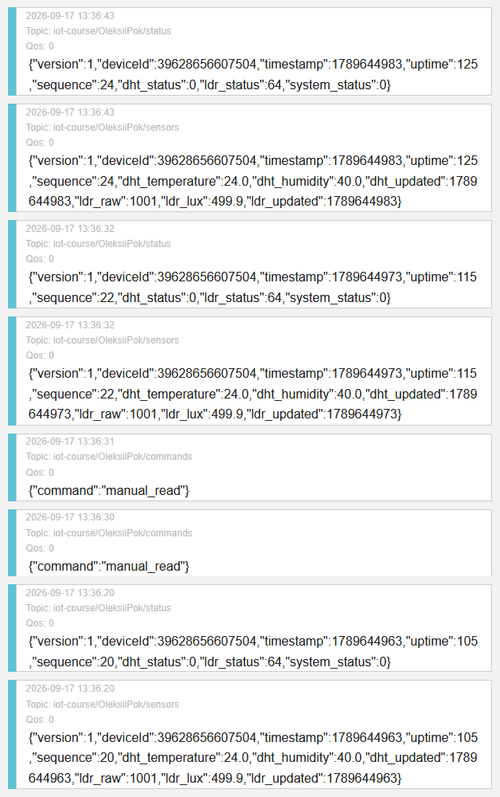

# IoT Project

[🇬🇧 English](./README/README.en.md) | [🇺🇦 Українська](./README/README.uk.md)



## Project Description

The project is an ESP32 firmware for monitoring environmental conditions and controlling device operation.

The device:

* reads temperature and humidity from a DHT22 sensor;
* reads ambient light from an LDR sensor and converts it to lux;
* checks sensor data for invalid values and alarm conditions;
* maintains separate sensor and system status registers;
* controls LEDs according to the current system and sensor states;
* provides button-based control of device modes;
* connects to WiFi and automatically attempts to restore the connection if it is lost;
* connects to an MQTT broker and publishes sensor data, status information, and commands;
* can send telemetry to an HTTP server;
* provides detailed information through the Serial Monitor in debug mode.

## Sensor Monitoring

The DHT22 sensor provides:

* temperature;
* humidity;
* sensor status.

Temperature and humidity are checked against configurable validation limits and alarm thresholds.

The configurable alarm thresholds are:

* `DHT_TEMPERATURE_ALARM_MIN_CONFIG`
* `DHT_TEMPERATURE_ALARM_MAX_CONFIG`
* `DHT_HUMIDITY_ALARM_MIN_CONFIG`
* `DHT_HUMIDITY_ALARM_MAX_CONFIG`

The LDR sensor provides:

* raw ADC value;
* calculated illumination in lux;
* sensor status.

The light level is checked against configurable limits and thresholds:

* `LDR_LUX_ALARM_MIN_CONFIG`
* `LDR_LUX_THRESHOLD_LIGHT_LOW_CONFIG`
* `LDR_LUX_ALARM_MAX_CONFIG`

The LDR conversion can also be adjusted using parameters such as `LDR_GAMMA`, `RL10`, `LDR_R_DIV_OHM`, and `LDR_VCC_V`.

## Status and Indication

Sensor and system conditions are represented by bit flags.

The device can detect and report conditions such as:

* sensor errors;
* invalid sensor data;
* low or high sensor values;
* silent mode;
* WiFi connection errors;
* MQTT connection errors.

LEDs indicate the current operating and alarm states, including light, temperature, humidity, silent mode, and command activity.

## Buttons

The device provides four physical buttons.

They are used for:

* manual command activation;
* silent mode;
* an additional button-controlled function;
* testing WiFi disconnection and automatic recovery.

Button states are processed separately from the device actions. Button handling also includes interrupt-based detection and debouncing.

## MQTT Communication

Device A communicates with Device B through the MQTT broker. The devices do not communicate directly with each other.

**MQTT broker:** `broker.hivemq.com:1883`

**MQTT client ID:** `OleksiiPok-esp32-a`

Device A uses the following MQTT Topic Names:

| Topic Name | Direction | Payload | Publishing interval |
|---|---|---|---|
| `iot-course/OleksiiPok/sensors` | Device A → Broker | JSON sensor data | 10 s |
| `iot-course/OleksiiPok/status` | Device A → Broker | JSON system status | 10 s |
| `iot-course/OleksiiPok/commands` | Device A → Broker | JSON command | On event |

Sensor data and system status are published every 10 seconds. Commands are published when a command is pending, for example after a button action.

Device A publishes with QoS 0. Device B subscribes to the `sensors` and `commands` Topic Names with QoS 1.

The current MQTT exchange is:

```text
Device A
   │
   │ PUBLISH sensors / status / commands
   ▼
MQTT Broker
   │
   │
   └───────────────┐
                   │
                   ▼
               Device B
          SUBSCRIBE sensors
          SUBSCRIBE commands
```

### MQTT Topics on the Broker




The MQTT broker, Topic Names, client identifier, buffer size, and reconnection parameters can be configured in `src/mqtt/mqtt_config.h`.

## HTTP Communication

The project also contains an HTTP client for sending complete telemetry data as JSON to a server.

The server endpoint can be configured using:

* `SERVER_URL`

## Telemetry

The internal telemetry structure contains:

* protocol version;
* device identifier;
* timestamp;
* uptime;
* message sequence number;
* DHT22 data;
* LDR data;
* system status.

Telemetry can be serialized to JSON and is used for MQTT and HTTP communication.

The MQTT interface separates sensor data and system status into different messages.

## Time

The device synchronizes its internal time using NTP.

It supports:

* UTC time;
* local time;
* configurable timezone.

The default timezone and NTP server are defined in `src/time/time.cpp`.

## Serial Monitor

In debug mode, the Serial Monitor provides detailed information about:

* DHT sensor status;
* LDR sensor status;
* system status;
* system state register;
* MQTT JSON payloads;
* WiFi and MQTT connection events.

Debug mode can be enabled with:

* `DEBUG_MODE`

## Configuration

The main operating intervals and sensor parameters are configured at compile time in `src/config.h`.

This includes:

* button polling interval;
* action processing interval;
* LED indication interval;
* WiFi checking interval;
* sensor reading intervals;
* telemetry and MQTT publishing intervals;
* memory checking interval;
* sensor alarm thresholds;
* ESP32 pin assignments.

The project is designed so that these parameters can be changed without modifying the main application logic.

[🇬🇧 English](./README/README.en.md) | [🇺🇦 Українська](./README/README.uk.md)
