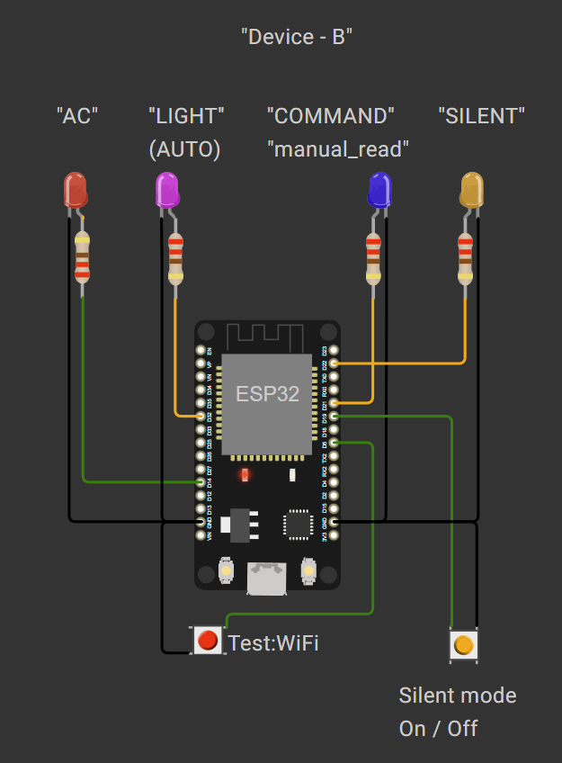

# IoT Project

[🇬🇧 English](./README.en.md) | [🇺🇦 Українська](./README.uk.md)



## Project Description

The project is an ESP32 firmware for receiving data and commands via MQTT and controlling local LED indication and buttons.

The device:

- connects to WiFi and automatically restores the connection after a disconnect;
- connects to an MQTT broker and subscribes to command and sensor-data topics;
- receives commands via MQTT;
- receives temperature and light data via MQTT;
- indicates selected states using LEDs;
- provides button control for the manual command and silent mode;
- provides a button for testing WiFi disconnection and automatic recovery;
- can output diagnostic information to the Serial Monitor when `DEBUG_MODE` is enabled.

## Main Operation

```text
Buttons ──> Actions ──> System State ──> LED Indication
                         ^
MQTT Commands ───────────┤
MQTT Sensor Data ────────┘

WiFi ──> MQTT
```

Temperature and light indication use configurable thresholds:

- `DHT_TEMPERATURE_ALARM_MIN_CONFIG`
- `DHT_TEMPERATURE_ALARM_MAX_CONFIG`
- `LDR_LUX_THRESHOLD_LIGHT_LOW_CONFIG`

## MQTT

The firmware works with two MQTT topics:

- `TOPIC_COMMANDS` — incoming commands;
- `TOPIC_SENSORS` — incoming temperature and light data.

Command messages are deserialized using `deserializeCommand()`. Sensor messages are deserialized using `deserializeSensors()`.

## Buttons and LEDs

The buttons are handled using interrupts and software debounce (`BUTTON_DEBOUNCE_TIME_MS`).

The implemented controls include:

- `BUTTON_COMMAND_MASK` — manual command;
- `BUTTON_SILENT_MASK` — silent mode;
- `BUTTON_WIFI_DISABLE_MASK` — WiFi disconnect test.

The LED state is represented by bit masks. The firmware currently uses indication for the command, silent mode, low-light condition, and high-temperature condition.

A manual command starts a short LED blink sequence (`MANUAL_BLINK_COUNT`, `MANUAL_BLINK_INTERVAL_MS`).

## Configuration

WiFi, MQTT, GPIO assignments, operating intervals, debounce time, and indication thresholds are configured at compile time.

The firmware is divided into modules for buttons, actions, commands, indication, WiFi, MQTT, deserialization, system state, time, device information, memory, and monitoring.
