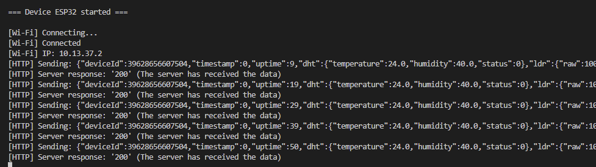

# IoT Project

[🇬🇧 English](./README.en.md) | [🇺🇦 Українська](./README.uk.md) | [🏠 Main README](../README.md)


## Project Description

The project is divided into modules, each with its own responsibility and individual call interval settings.

The `actions` module is at the center of the project. It combines functions and transfers data between modules.

Data processing is handled by the `telemetry` module.


### Data Structure

The data structures used in the project are presented below.

```cpp
struct DHTData {
    float temperature; // °C
    float humidity;    // %
    uint8_t status;
};

struct LDRData {
    uint16_t raw; // ADC data (0–4095)
    float lux;    // data in lux
    uint8_t status;
};

struct Telemetry {
    uint64_t deviceId;
    uint32_t timestamp;
    uint32_t uptime;
    DHTData dht;
    LDRData ldr;
    uint8_t status; // system status register
};
```
### Internal status register

Two status flag registers, `buttonStatus` and `ledStatus`, are used to preserve the state of buttons and indicators and to make their state remotely readable and controllable (in a future).

All possible pin constants, states, intervals, and bit masks are defined using `#define`.

The call interval for each module is defined in `Config.h`.

Constants specific to a particular module are located either in the corresponding `*.h` file or in the `*.cpp` file, depending on the required scope.

### Sensor Value Validation

The following value thresholds are defined for the sensors:

- `VALID_MIN`
- `ALARM_MIN`
- `ALARM_MAX`
- `VALID_MAX`

In addition, the system checks for `NaN` values.

If a sensor value is `NaN`, the `STATUS` field is set to `DEVICE_ERR`.

If a value goes outside the `VALID_MIN` or `VALID_MAX` range, the corresponding `VALID_MIN` or `VALID_MAX` status is set.

If a value goes outside the `ALARM_MIN` or `ALARM_MAX` range, the corresponding `ALARM_MIN` or `ALARM_MAX` status is set.

Some out-of-range conditions are additionally represented by LED indicators in the circuit.

All these thresholds can be changed at compile time and adjusted when required.

### Light Sensor

The light sensor additionally uses the `LIGHT_LOW` threshold.
The project and circuit implement automatic LED activation when the measured light level falls below `LIGHT_LOW`.

### WiFi Connection Recovery

For testing purposes, the project implements WiFi disconnection using a button. When the WiFi connection is disconnected, the project automatically starts the connection recovery process.

### Serial Monitor

The project supports transmitting data to the `Serial Monitor`.

Data transmission is enabled using the corresponding button.

### Configuration

The current values of thresholds, intervals, and other parameters are primarily intended to make the project convenient to test. They most likely do not correspond to real-world operating conditions and can be adjusted for actual deployment.

### Examples of data


