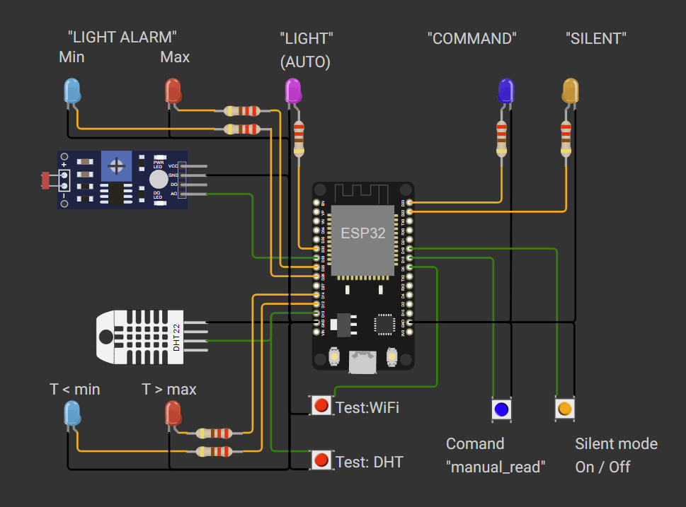

[🇬🇧 English](./README.en.md) | [🇺🇦 Українська](./README.uk.md)

##

# IoT Project

## Project Description

The project is an ESP32 firmware for monitoring environmental conditions, processing device states, and communicating telemetry.

The firmware is organized into independent modules for:

* DHT22 temperature and humidity monitoring;
* LDR ambient light measurement and lux calculation;
* telemetry and status processing;
* buttons and device actions;
* LED indication;
* Wi-Fi and NTP time synchronization;
* MQTT communication;
* Serial Monitor diagnostics.

## Project Structure

The main modules are:

* `dht_sensor` — temperature, humidity, validation, alarms, and sensor status;
* `ldr_sensor` — ADC reading, lux calculation, validation, alarms, and sensor status;
* `telemetry` — common device data, timestamps, uptime, sequence, and STALE watchdog;
* `system` — aggregated system state;
* `buttons` — physical button input;
* `actions` — device commands and LED state processing;
* `indication` — LED indication patterns;
* `wifi` — Wi-Fi connection management;
* `time` — NTP synchronization and timezone;
* `mqtt` — MQTT connection, publishing, and services;
* `serialization` — telemetry, status, and command JSON;
* `monitor` — debug output.

## Telemetry Data

The internal telemetry structure contains:

* protocol version;
* device ID;
* timestamp;
* uptime;
* sequence number;
* DHT22 data;
* LDR data;
* button state;
* system state;
* LED state.

DHT22 data contains:

* temperature;
* humidity;
* last successful update time;
* update uptime;
* status.

LDR data contains:

* raw ADC value;
* calculated lux;
* last successful update time;
* update uptime;
* status.

## STATE, STALE and Status Aggregation

### STATE

`systemState` is a bit-field representing the current system conditions.

It contains managed states such as:

* silent mode;
* command activity;

and system error states for:

* DHT;
* LDR;
* Wi-Fi;
* time synchronization;
* MQTT.

Error bits are initialized as active and are cleared only after the corresponding condition is confirmed to be normal.

### STALE

`STALE` is a sensor-data freshness flag.

The watchdog periodically sets `STALE` for DHT and LDR data. A successful sensor read clears the corresponding `STALE` flag. If a read fails, `STALE` remains active.

Thus, `STALE` indicates that a new successful sensor update has not been confirmed.

### Status Aggregation

Sensor status is maintained separately for DHT and LDR.

`systemState` aggregates the important sensor and communication errors into system-level error flags. LED indication and other actions use these states without duplicating the underlying sensor data.

## MQTT Communication

The device communicates with an MQTT broker through the configured MQTT service.

The MQTT interface uses three message types:

* `telemetry` — sensor data together with common telemetry fields and system state;
* `status` — DHT, LDR, and system status information;
* `commands` — device commands.

Telemetry and status messages include:

* protocol version;
* device ID;
* timestamp;
* uptime;
* sequence number;
* DHT status;
* LDR status;
* system state.

Telemetry additionally contains DHT temperature and humidity and LDR raw ADC and lux values.

Commands are serialized as JSON command messages.

## Configuration

Main operating intervals are defined in `src/app_config.h`.

Hardware pins are defined in `src/hardware_config.h`.

Sensor limits and alarm thresholds are defined in:

* `src/dht_sensor/dht_config.h`;
* `src/ldr_sensor/ldr_config.h`.

MQTT service and topics are defined in `src/mqtt/mqtt_config.h`.

Timezone and NTP settings are defined in `src/time/time_config.h`.

## Debug Monitor

When `DEBUG_MODE` is enabled, the Serial Monitor provides information about sensor data, system state, connection events, and MQTT payloads.

##

[🇬🇧 English](./README.en.md) | [🇺🇦 Українська](./README.uk.md)