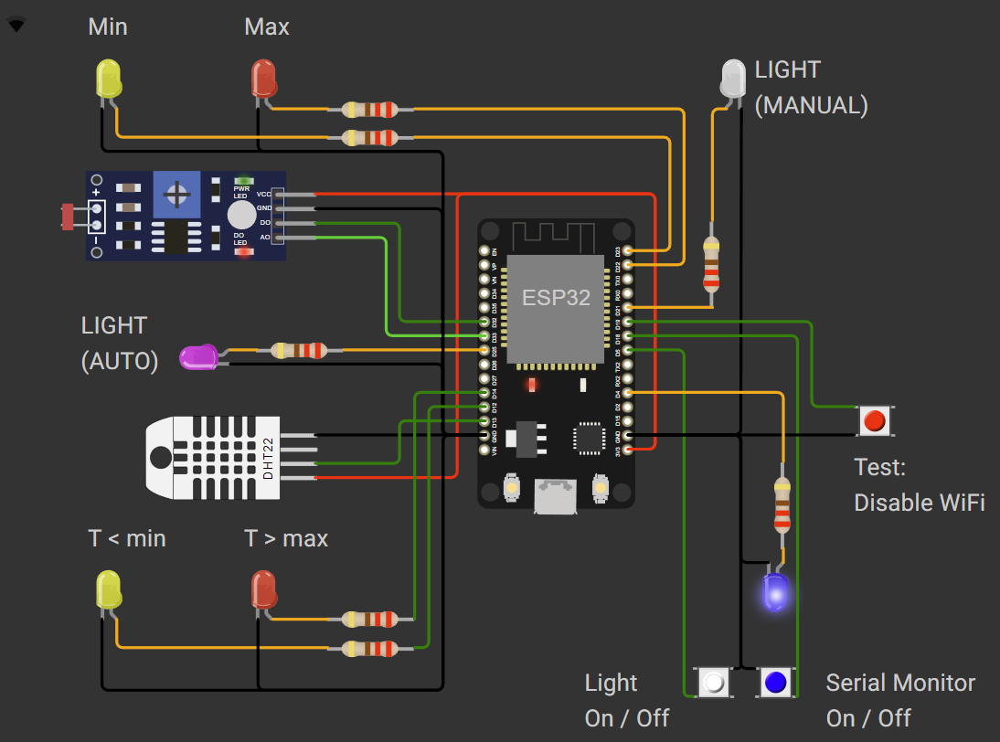
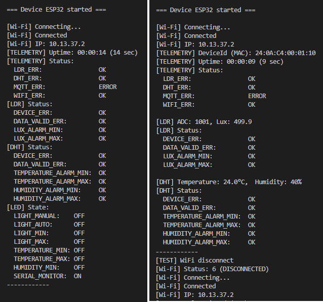

# IoT-проєкт

[🇬🇧 English](./README.en.md) | [🇺🇦 Українська](./README.uk.md) | [🏠 Головний README](../README.md)



## Опис проєкту

Проєкт розділений на модулі, кожен з яких має власну відповідальність та індивідуальні налаштування інтервалу виклику.

У центрі проєкту знаходиться модуль `actions`. У ньому відбувається об'єднання функцій та передача даних між модулями.

### Структура даних

```cpp
struct DHTData {
    float temperature; // °C
    float humidity;    // %
    uint8_t status;
};

struct LDRData {
    uint16_t raw; // ADC data (0–4095)
    float lux;    // data in lux
    uint8_t status;
};

struct Telemetry {
    uint64_t deviceId;
    uint32_t timestamp;
    uint32_t uptime;
    DHTData dht;
    LDRData ldr;
    uint8_t status; // system status register
};
```

Для збереження стану кнопок та індикаторів, а також для можливості віддаленого зчитування та керування ними, використовуються два регістри прапорців стану: `buttonStatus` та `ledStatus`.

Усі можливі константи пінів, станів, інтервалів та бітових масок винесені в `#define`.

Інтервали виклику кожного модуля знаходяться у файлі `Config.h`.

Константи, що належать конкретному модулю, знаходяться або у відповідному файлі `*.h`, або у файлі `*.cpp` — залежно від необхідної області видимості.

### Контроль значень сенсорів

Для сенсорів визначені такі граничні значення:

- `VALID_MIN`
- `ALARM_MIN`
- `ALARM_MAX`
- `VALID_MAX`

Крім цього, контролюється відсутність значення `NaN`.

Якщо значення сенсора дорівнює `NaN`, у полі `STATUS` встановлюється статус `DEVICE_ERR`.

Якщо значення виходить за межі `VALID_MIN` або `VALID_MAX`, встановлюється відповідний статус `VALID_MIN` або `VALID_MAX`.

Якщо значення виходить за межі `ALARM_MIN` або `ALARM_MAX`, встановлюється відповідний статус `ALARM_MIN` або `ALARM_MAX`.

Частина виходів за межі допустимих значень додатково відображається за допомогою світлодіодної індикації на схемі.

Усі ці значення можна змінювати під час компіляції та налаштовувати за потреби.

### Сенсор освітленості

Для сенсора освітленості додатково використовується поріг `LIGHT_LOW`.

У проєкті та схемі реалізовано автоматичне ввімкнення світлодіода при зниженні рівня освітлення нижче `LIGHT_LOW`.

### Відновлення WiFi-з'єднання

Для тестування в проєкті реалізовано відключення від WiFi за допомогою кнопки. Після відключення WiFi-з'єднання проєкт автоматично запускає процес відновлення з'єднання.

### Serial Monitor

У проєкті реалізовано передавання даних до `Serial Monitor`.

Передавання даних вмикається відповідною кнопкою.

### Налаштування

Поточні значення порогів, інтервалів та інших параметрів встановлені переважно для зручності перевірки проєкту. Найімовірніше, вони не відповідають реальним умовам експлуатації та можуть бути змінені для практичного використання.

### Examples of data

